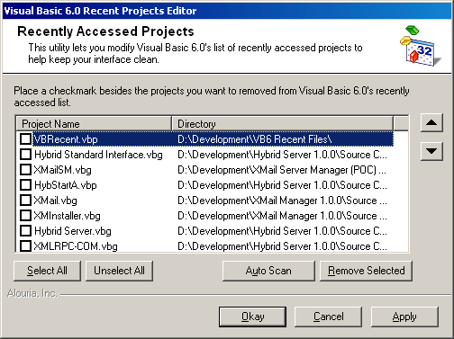



## VB6 Recent Projects Editor

### Description

I got tired of editing VB6's recent project list in the registry, especially after downloading and running tons of code samples. So I wrote a quick little application to do it for me and decided to share it with everyone else. Hope you find it useful!
 
### More Info
 
This only works for VB6, but I'm sure it could be modified quickly for VB5 or even VB4.

             |
---                |---
**Submitted On**   |2003-08-05 22:15:18
**By**             |[Alouria](https://github.com/Planet-Source-Code/PSCIndex/blob/master/ByAuthor/alouria.md)
**Level**          |Intermediate
**User Rating**    |4.9 (59 globes from 12 users)
**Compatibility**  |VB 6\.0
**Category**       |[Complete Applications](https://github.com/Planet-Source-Code/PSCIndex/blob/master/ByCategory/complete-applications__1-27.md)
**World**          |[Visual Basic](https://github.com/Planet-Source-Code/PSCIndex/blob/master/ByWorld/visual-basic.md)
**Archive File**   |[VB6\_Recent162469862003\.zip](https://github.com/Planet-Source-Code/alouria-vb6-recent-projects-editor__1-47440/archive/master.zip)

